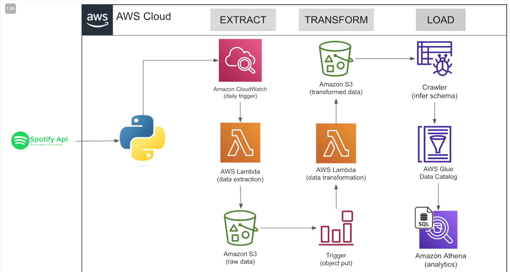
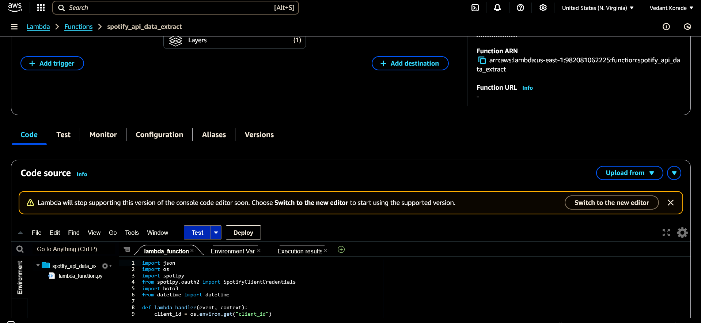
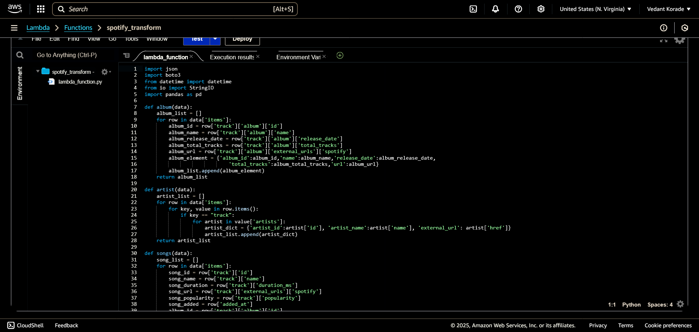
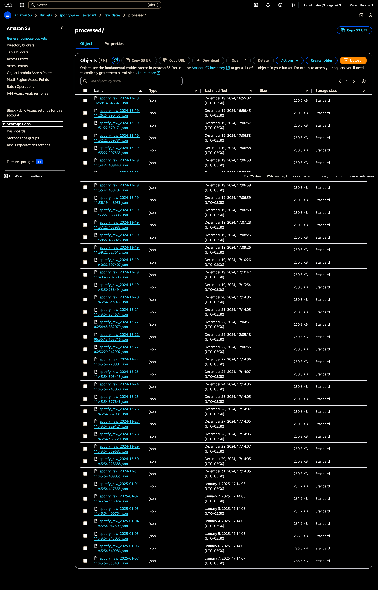
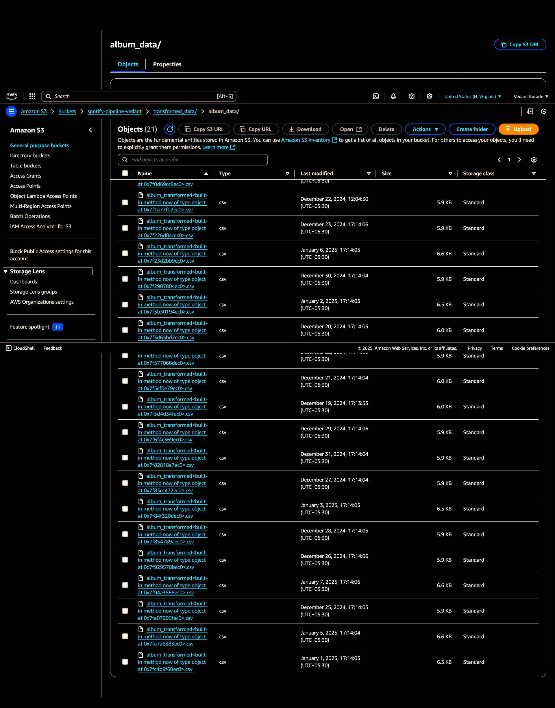

# Spotify E2E Data Pipeline Project

This project demonstrates an end-to-end data pipeline for extracting, transforming, and analyzing Spotify playlist data. The pipeline is built using Python and integrates with AWS services for data storage and processing.

## Features
- Extracts playlist, album, artist, and song data from Spotify using the Spotipy library.
- Transforms the data into structured formats using Pandas.
- **Automated pipeline**: Designed to run using AWS Lambda and Step Functions.
- Provides insights and visualizations for the extracted data.

## Architecture
The pipeline follows a modular architecture:
1. **Data Extraction**: Fetches data from Spotify's API.
2. **Data Transformation**: Cleans and structures the data into DataFrames.
3. **Data Storage**: Stores the transformed data in AWS.
4. **Data Analysis**: Enables querying and visualization of the data.



## Note on Automation
The pipeline is fully automated using AWS Lambda and Step Functions. However, triggers and database storage might have been temporarily disabled to reduce costs and database space. To re-enable them:
1. Uncomment the relevant sections in the code for AWS Lambda triggers.
2. Reconfigure database storage (e.g., AWS RDS or DynamoDB) in the notebook.

## Prerequisites
- Python 3.7 or higher
- Spotify Developer Account (to obtain `client_id` and `client_secret`)
- AWS Account (for storage and processing)
- Required Python libraries: `spotipy`, `pandas`, `boto3`

## Setup Instructions

### 1. Clone the Repository
```bash
git clone https://github.com/your-username/Spotify-E2E-Data-Pipeline-Project.git
cd Spotify-E2E-Data-Pipeline-Project
```

### 2. Install Dependencies
Install the required Python libraries:
```bash
pip install -r requirements.txt
```

### 3. Configure Spotify API
Update the `client_id` and `client_secret` in the notebook:
```python
client_credentials_manager = SpotifyClientCredentials(
    client_id="<Enter Your Client ID here>", 
    client_secret="<Enter Your Client Secret here>"
)
```

### 4. Configure AWS
Set up AWS credentials using the AWS CLI or environment variables:
```bash
aws configure
```

### 5. Run the Notebook
Open the Jupyter Notebook and execute the cells step-by-step:
```bash
jupyter notebook Spotify\ Data\ Pipeline\ Project.ipynb
```

### 6. Re-enable Automation (Optional)
To restore automation:
- Uncomment the AWS Lambda and Step Functions code in the notebook.
- Deploy the pipeline to AWS.

### 7. Re-enable Database Storage (Optional)
To store data in AWS RDS or DynamoDB:
- Uncomment the database storage code in the notebook.
- Configure the database connection string.

## Sample Outputs
### Data Extraction


### Data Transform


### Processed Data


### Transformed Album Data


## Future Enhancements
- Add support for additional Spotify data (e.g., user data, playlists).
- Integrate with visualization tools like Tableau or Power BI.

## License
This project is licensed under the MIT License. See the [LICENSE](LICENSE) file for details.

## Acknowledgments
- [Spotipy](https://spotipy.readthedocs.io/) for Spotify API integration.
- AWS for cloud services.
